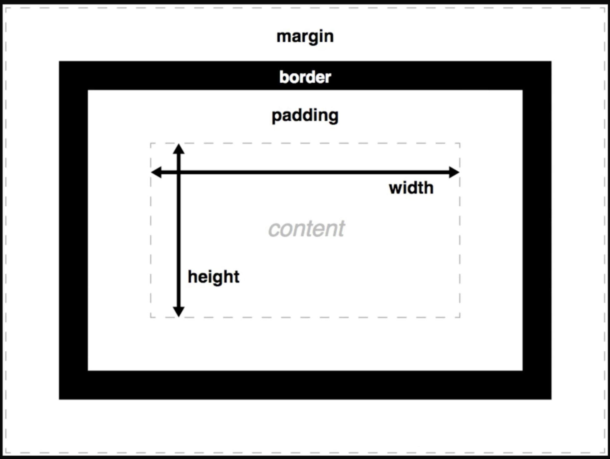

## Виды сайтов

1. Landing page

- Одностраничный интеренет-магазин  
- Сайты - визитки  
- Сайты - опросники

2. Корпоративные сайты  
3. Интеренет - магазины  
4. Форумы  
5. Информационные  
6. Сервисы и приложения  

## Этапы разработки сайтов

1. Интервью (менеджер или дизайнер)
2. Дизайн (Дизайнер)

- Moodboard(доска идей - что должно содержаться на сайте)
- Текстовый прототип
- Визуальный прототим
- Дизайн макет

3. Верстка (frontend)

- HTML + CSS
- JS

4. Программирование (Backend - разработчик)

- Посадка на CMS  
или
- написание своего движка

5. Продвижение (SEO/Таргетолог)

- SEO
- Контекстная реклама
- Таргетированная реклама  

## Что относится к frontend и backend

### Frontend

1. HTML

- Pug

2. CSS

- Sass/Scss
- Less
- Bootstrap
- Foundation

3. JavaScript

- React
- Angular
- Vue
- Jquery

### Backend

1. PHP

- Laravel
- Yii2

2. Node.js

- Express.js

3. Python

- Django

4. Ruby

- Ruby on Rails

5. CMS

- Wordpress
- Opencart
- Joomla
- Bitrix

6. Базы данных

- MongoDB
- mySQL
- и другие

### Правила ведения проекта

1. Создавать красивую структуру проекта
2. Правильно называть элементы
3. Не использовать кириллицу и пробелы

Примечание

- Для больших картинок(фон, фотографии) использовать формат JPG или JPEG
- Для маленьких картинок(фон, значек и т.п.) использовать PNG формат  

## Tags

- \<!DOCTYPE tipe_of_document> - тип документа
- \<html lang="language">\</html> - самый главный тег на странице
- \<head><!head> - в head прописываем настройки страницы
- \<meta charset="UTF-8"> - кодировка страницы
- \<meta name="viewport" content="width=device-width, initial-scale=1.0"> - для красивого и правильного отображения на телефонах
- \<meta http-equiv="X-UA-Compatible" content="IE=edge"> - для совместимости с IE
- \<meta> name="description" content="Это мой первый пример страницы" - описание страницы
- \<meta> name="author" content="Василий" - автор страницы
- \<title>Document\</title> - заголовок страницы(название)
- \<body>\</body> - контент
- \<h1>\</h1> - \<h6>\</h6> - теги заголовков. H1 может использоваться только 1 раз на странице. Все типы заголовков должны идти после предыдущего, либо, если заголовок предыдущего порядка был уже использован

- \<ol>"li-шки"\</ol> - создание списка(ordered list) с нумерацией
- \<li>content\</li> - создание элемента списка с нумерацией с 1 (list item)
- \<ul>"li-шки"\<ul> - создание списка (unordered list) без нумерации
- <\div>content\
 - тег блока
- \ - вставка изображения, где src это source(источник) изображения, а alt отвечает за описание изображения, вводим краткое название изображения

### Семантические теги HTML5

- \<header>content\</header> - шапка сайта - все, что относится к верхней части сайти - это может быть меню, логотипы, виджет поиска и т.п
- \<nav>content\</nav> - тег навигации, навигационное меню, содержание книги и т.п
- \<article>\</article> - используется для оформления, какой-либо записи в блоге
- \<section>section\</section> - это тег блока для разграничивания секций на сайте, чаще всего используется в лендингах для разграничения секций
- \<aside>block\</aside> - в этот тег оборачиваем блоки расположенные сбоку(слева, справа) от контента, оборачиваем боковую колонку с информацией
- \<main>content\</main> - в этот тег заключаем все видимое содержимое сайта, основное содержимое сайта
- \<address>address\</address> - помещаем адрес компании, фирмы и т.п
- \<footer>block\</footer> - "подвал" сайта, блок распложенный в самом низу сайта
- \<time></time> - какое-либо время, которое хотим показать пользователю

### Работа с текстом

- \  - перенос на новую строку
- \
 - горизонтальная линия
- \
text\
 - вставка текста с нового параграфа
- \<i>text\</i> - выделяем текст курсивом
- \<em>text\</em> - выделяем текст курсивом для логического обьяснения??? Визуально логически работает, как и тег i
- \<b>text\</b> - делаем текст жирным
- \<strong>text\</strong>
  - делаем текст жирным для логического обьяснения??? Визуально логически работает, как и тег b
- \<mark>text\</mark> - цветовое выделение текста
- \<u>текст\</u> - подчеркивание текста
- \<s>текст\</s> - зачеркивает текст
- \текст\ - отображает текст в виде нижнего индекса
- \текст - отображает текст в виде верхнего индекса
- \<a href="">\</a> - ссылка
- \<wbr> - перенос строки, когда она не влезает в блок

### Some info about tags

- Теги бывают парные и не парные(одинарные и двойные)
- Теги делятся на невидимые и рабочие
- Ссылки бывают внешними и внутренними

### tag antributs

- \<ol type="" start="3">\</ol>

1. type=

- "1" - нумерация от 1 и до конца
- "A" - каждый элемент списка идет по алфавитному порядку в верхнем регистре
- "I" - нумерация римскими цифрами в верхнем регистре
- "a" - каждый элемент списка идет по алфавитному порядку в нижнем регистре
- "i" - нумерация римскими цифрами в ниждем регистре

2. start=

- "3" - нумерация начинается с 3, тоже самое и для остальных атрибутов type

### Some info about tag antributs

- Теги бывают спецефические(для каждого тега свои) так и общие - общего назначения, которые можно применять к абсолютно любому тегу

## CSS

- \<link rel="stylesheet" href="path"> - подключаем файл со стилями в конце header
- \ - подключаем стили прописывая их в начале body
- \ - подключаем стили прописывая их в начале body, либо используя просто @import 'path', подлючаем доп стили в файл со стилями
- \<anytag style="style atrtributs for tag"></anytag> - задаем индивидуальный стиль для каждого тега
- селектор{  
        свойство:значение;  
        свойство_2:значение_2;  
        свойство_3:значение_3;  
  }  
- \<anytag class="class name"></anytag> - задаем любому тегу класс, для использования в стилях, т.е поиска 1 конкретного элемента, далее в файле .css прописываем и применяем индивидуальные настройки для конкретного тега  
.class name {  
    свойство: значение;  
}  
- \<anytag id="id name"></anytag> - задание свойств по ID, id может быть только 1 на странице  
\#idname {  
    свойство:значение;  
}  

### Свойства селекторов

- color: reserved - используем, какой-либо зарезервированный цвет
- color: hex - вставляем цвет в хекс формате
- color: rgb - вставляем цвет в формате rgb
- color: rgba - вставляем цвет в формате rgba, где a это уровень прозрачности от 0 до 1
- text-align: положение на странице
- font-weight: толщина текста
- font-style: стиль текста
- text-decoration:underline - подчеркивание текста
- text-decoration: line-through - зачеркивание текста
- font-size: размер шрифта;
- text-transform: capitalize, lowercase uppercase и т.п

## Блочная модель CSS

- width - ширина
- height - высота
- пунктирной линией выделен сам контент
- border - граница:
- padding - внутренний отступ между контентом и границей
- margin - внешний отступ, который отвечает за позиционирование блока на странице, т.е, если с какой-либо стороны будет еще 1 блок то благодаря margin, отодвинемся от него

1. border(padding, margin) top - верхняя граница
2. border(padding, margin) right - правая граница
3. border(padding, margin) left - левая граница
4. border(padding, margin) bottom - нижняя граница

Перечисленные выше границы можно задавать все вместе или по отдельности.  

- padding(margin): Apx - отступ со всех сторон на значение А пикселей
- padding(margin): Apx Bpx; - за отступ по вертикали отвечает А пикселей, по горизонтали отвечает B пикселей
- padding(margin): Apx Bpx Cpx Dpx - сверху отступ А, справа B, снизу C, слева D
- border-width: Аpx; - граница с шириной А пикселей
- border-style: solid; - выделение границы сплошной линией
 border-style: dashed; - выделение границы пунктирной линией
- border-color: color; - цвет границы
- border: 3px solid color; - комбинация последний 3 операций сверху в 1 строку

### Helpful info links

- [wireframe](https://wireframe.cc/)- создание макета
- [ninjamock](https://ninjamock.com/ru) - создание макета
- [avocode](https://avocode.com/convert-psd-to-sketch) - конвертер PSD to Sketch
- [marsy](https://www.markupeasy.ru/) - редактор макета
- [vectorizer](https://www.vectorizer.io/) - конвертер в векторную графику
- [конвертер](https://www.online-convert.com/) - конвертер файлов
- [webref](https://webref.ru/) - справочник по HTML и CSS
